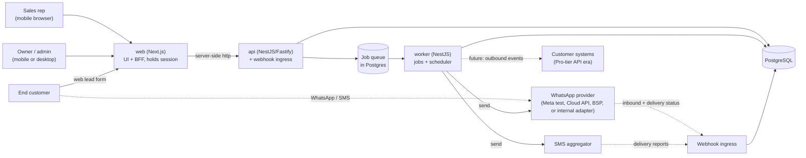
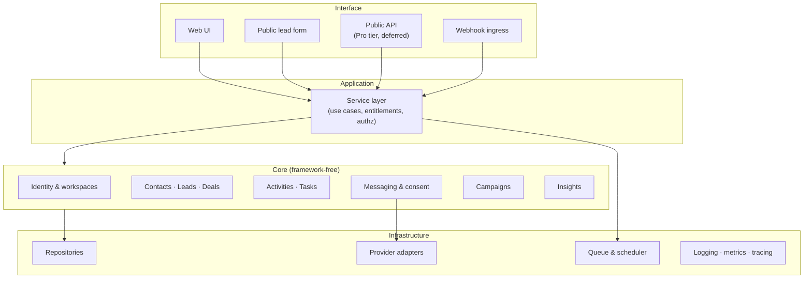
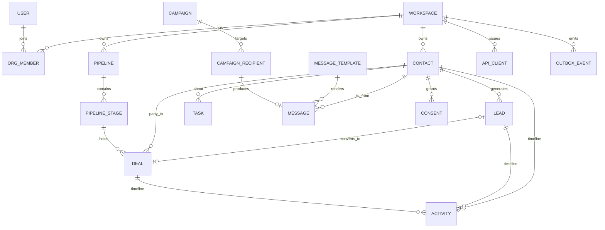
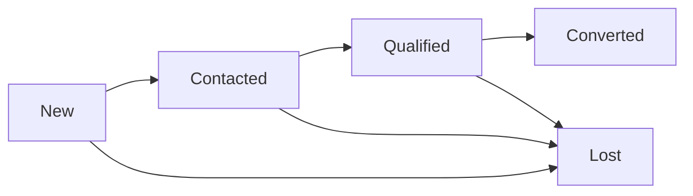
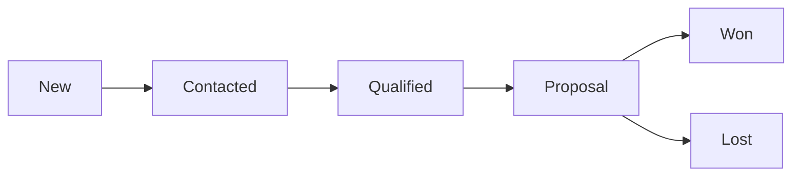
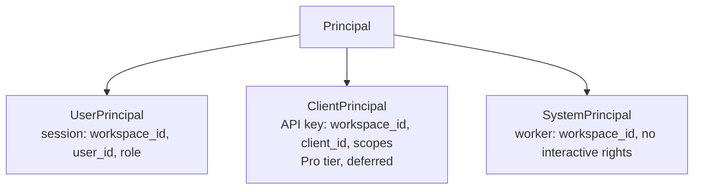
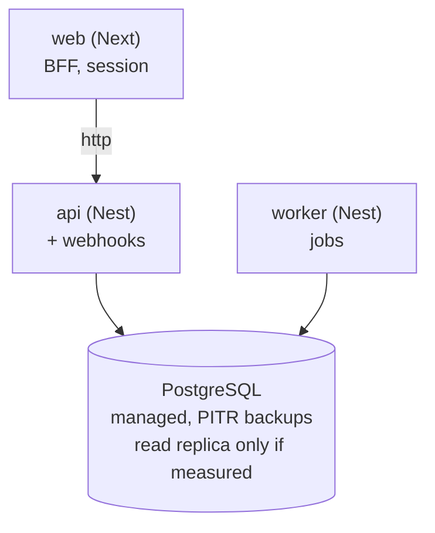

# Convert. Architecture

Target architecture for the MVP defined in [`mvp-scope.md`](./mvp-scope.md), designed so the deferred product in [`product-spec.md`](./product-spec.md), quotes, invoices, payments, attribution, and the **Pro-tier public API**, can be added without rework.

Written stack-agnostic and still largely stack-independent: the layering, invariants, and messaging design hold regardless of runtime. The stack itself is now decided, §3, ADR 0001.

**Last updated:** 2026-08-21

**Status:** Proposal. Sections marked **[DECIDE]** carry a checklist ID and need product-owner sign-off before implementation.

---

## 1. Constraints that drive every decision

| # | Constraint | Source | Architectural consequence |
|---|-----------|--------|---------------------------|
| C1 | Reps work from phones on variable mobile networks | deck slide 7, scope §18 | Server-rendered where possible; hard JS budget; every write tolerant of a dropped connection |
| C2 | WhatsApp is the primary channel and is rule-bound | deck slide 7, checklist E4 | Messaging is a first-class subsystem with its own state machine, not a utility function |
| C3 | Multiple businesses share one deployment | scope §5 | Row-level tenancy enforced below the application layer, never by convention |
| C4 | Activity history must outlive the rep who created it | deck P3, scope §10 | Append-only log; no destructive edits |
| C5 | A public API is sold at Pro tier | deck slide 6, Phase 3 | Principals, opaque IDs, idempotency, and outbound events designed now, exposed later |
| C6 | Messaging costs real money per send | checklist E4 | Every send metered, queued, paced, and idempotent |
| C7 | Third-party customer PII under Ghana Act 843 | checklist L1–L4 | Consent as data; export and deletion designed in, not bolted on |
| C8 | No billing in the MVP | scope §20 | Entitlements are a readable policy layer with limits switched off, not absent code |

---

## 2. Principles

1. **Domain logic is framework-free.** Business rules live in a `core` layer that imports nothing from the web framework or the ORM. This is what makes the stack slot in §3 genuinely deferrable.
2. **The UI is the first API client.** Screens call the same service layer a public API would. Exposing the API later becomes an authentication and serialization concern, not a rewrite.
3. **Tenancy is enforced, not remembered.** A query that forgets `workspace_id` must fail, not silently return another business's data.
4. **State changes emit facts.** Every meaningful change writes an activity row and, where relevant, an outbox event. Read models and future webhooks are derived from those facts.
5. **External calls are adapters.** WhatsApp, SMS, and any future accounting integration sit behind a port. The domain never knows the vendor.
6. **Everything crossing the network is idempotent.** Provider webhooks retry, phones resubmit on flaky connections, and campaign workers get restarted. Duplicates are a design input.
7. **Build the seam, not the feature.** For deferred capabilities, add the boundary and stop. No speculative tables, no half-built invoicing.

---

## 3. Stack, decided (S1, ADR 0001)

TypeScript throughout, one pnpm monorepo, three runtimes, one datastore.

| Concern | Choice |
|---------|--------|
| Web | **Next.js**, App Router. UI plus BFF route handlers that hold the session |
| API | **NestJS on the Fastify adapter**. HTTP interface, webhook ingress, later the Pro-tier public API |
| Worker | **NestJS standalone application context**, sharing modules with the API |
| Domain | `packages/core` and `packages/application`, framework-free, shared by API and worker |
| Datastore | **PostgreSQL 16**, with row-level security as the tenancy boundary. CI and local development both run 16; the managed server on Railway has not been checked against it, and a major-version gap would put ADR 0042's policy expression and ADR 0044's enum ordering on an unproven version |
| Query layer | **Drizzle ORM** + Drizzle Kit migrations, in `packages/infra` only (ADR 0017) |
| Jobs | Postgres-backed queue (ADR 0010), no second stateful service |
| API docs | OpenAPI generated from code and committed (ADR 0015) |
| Cache, object storage | Deferred. Not on the critical path at pilot scale |

Three processes rather than the two a server-rendered monolith would need. What that buys: the API boundary the deck already sells at Pro tier exists from day one, NestJS DI makes the ports-and-adapters wiring structural rather than a convention, the worker is a first-class runtime sharing use cases, and webhook ingress is insulated from UI deploys. Shipping a screen cannot drop a WhatsApp delivery receipt.

What it costs, recorded honestly: more boilerplate per CRUD path, a cross-origin session problem (solved by the BFF in ADR 0013), longer CI, three processes to run locally, and a DTO duplication risk between web and API (contained by ADR 0014 and by generating the web client from the committed OpenAPI spec).

### The one hard operational constraint

**`web`, `api`, and Postgres deploy to the same region.** Every page render is now web → api → database. Co-located that is a few milliseconds; split across continents, the web app on a US or EU edge platform with the database in Africa, it is two intercontinental round trips per render against a 2.5 s LCP budget on 3G (§18). This effectively rules out an edge-only deployment and points at a container host in the chosen region.

### Layering

The dependency rule, the layer matrix, and the composition-root rule are machine-enforced. `.boundaries.json` is the executable form of §5, checked by `tools/check_boundaries.py` as the first CI gate. See [`engineering-guardrails.md`](./engineering-guardrails.md) §2.

---

## 4. System context



Three entry points, and they have different threat and reliability profiles:

- **Authenticated app**. Sessions, workspace-scoped, human pace.
- **Public lead form**. Unauthenticated, rate-limited, spam-exposed, writes into a specific workspace.
- **Webhook ingress**. Unauthenticated by session but signature-verified, high retry volume, must be idempotent.

Keep them separate from the first commit. Merging them is how the lead form ends up trusted.

---

## 5. Module map



**The rule that matters:** all four interfaces converge on one service layer. Authorization, entitlement checks, and activity logging happen there, once, so the public API cannot later become a second, weaker door into the same data.

| Context | Owns | Deliberately does not own |
|---------|------|---------------------------|
| Identity & workspaces | Workspaces, users, membership, roles, invitations, sessions, API clients | Anything customer-facing |
| CRM | Contacts, leads, deals, pipeline, stages, sources | How anyone was messaged |
| Activities & tasks | Append-only activity log, follow-up tasks, reminders | Message delivery mechanics |
| Messaging & consent | Messages, templates, consent records, conversation windows, provider events | Why a message was sent |
| Campaigns | Campaign definitions, recipient lists, send orchestration | The transport itself |
| Insights | Read models for the dashboard, source rollups | Writes of any kind |

---

## 6. Domain model



### The two state machines

Separate on purpose. The pitch deck showed one list of stages; merging them loses the
distinction between "is this worth my time" and "how close is this to money", and a report built
on the merged version cannot say whether the problem is lead quality or closing ability.

A lead is chased:



A deal is worked:



`Converted` requires a linked deal and `Lost` requires a reason (I4). Deal outcomes are terminal:
reopening creates a new deal rather than reviving the old one (I5).

### Entities beyond scope §24, and why each exists

| Entity | Reason |
|--------|--------|
| `consent` | Marketing opt-in is a Meta requirement (E4.2) *and* an Act 843 requirement (L3). Needs timestamp, source, channel, and withdrawal. A boolean on `contact` cannot carry that |
| `provider_event` | Raw inbound webhook payloads, stored before interpretation. The idempotency key and the audit trail when a provider disputes delivery |
| `campaign_recipient` | Per-recipient send state. A campaign is not one send; it is N sends with N independent outcomes |
| `api_client` | Pro-tier API credentials (C5). Present as a table, unreferenced until the API ships |
| `outbox_event` | Durable record of domain facts, for outbound integration webhooks and for rebuilding read models |
| `audit_event` | System-level actions, logins, role changes, deactivations, exports. Distinct from `activity`, which is the sales timeline reps read |

### Key fields on `contact`

`phone_e164` is the natural identity (R1, ADR 0030). Normalize to E.164 on write, store the raw input alongside for support, and index uniquely per workspace. A contact may hold several numbers in `contact_phone`, one flagged primary, **all** of them matchable for inbound — multi-SIM is normal in Ghana, and a single column silently creates a duplicate contact the first time someone messages from their other network. A contact needs at least one of phone or email, not both.

`last_inbound_at` is maintained on every inbound message. It is what determines whether the WhatsApp 24-hour window is open, see §10.3.

### Invariants

**Decided 21 August 2026** in the product-owner session (R1–R9, A1–A6). I1, I2, I3, I4 and I7 changed
as a result; the ADR against each row is where the reasoning lives. Removing or weakening one of
these requires an ADR that supersedes its source.

| ID | Invariant | Source |
|----|-----------|--------|
| I1 | Every tenant-owned row carries a non-null `workspace_id`. No cross-tenant access, **except an audited platform-admin action** | 0030, 0035 |
| I2 | A phone number is unique per workspace across `contact_phone`, and **every** stored number is matchable for inbound. A collision surfaces a merge prompt, never a validation error | 0030 |
| I3 | A `lead` may exist with no `deal`. A `deal` requires a `contact` and references one product. A `lead` may have **many** deals, at most one **open** per product | 0031 |
| I4 | `lead.status = Converted` requires **at least one** linked `deal`. `lost_reason` is **optional**. `Lost` is terminal: a returning customer produces a new lead | 0031 |
| I5 | `deal` outcomes `Won`/`Lost` are terminal; reopening creates a new deal, preserving history | — |
| I6 | `activity` rows are insert-only. No update, no delete, at any layer (C4) | — |
| I7 | Deactivating a member never orphans records: they are reassigned to a named member **or returned to the unassigned queue** | 0032 |
| I8 | Money is integer pesewas, currency fixed to GHS (R5) | — |
| I9 | A marketing message requires a live `consent` row for that channel at send time (L3, E4.2) | — |
| I10 | A free-form WhatsApp message requires an open conversation window; otherwise only a template may be sent (§10.3) | — |
| I11 | All timestamps stored UTC; all display and all "due"/"overdue" arithmetic in Africa/Accra (R6) | — |
| I12 | Every entity's **primary key** is a ULID in a `uuid` column, supplied by the application. There is no internal identifier, so none can leak (R9) | 0043 |

The 21 August session also created invariants the numbering does not yet cover, because they belong
to entities that scope did not previously include. They are listed here so they are not lost, and
they take numbers when the entities land:

| Invariant | Source |
|-----------|--------|
| A `contact` requires at least one of phone or email; a `user` likewise | 0030, 0029 |
| A list query for a member without `can_view_all_leads` returns only their own records plus unassigned ones | 0032 |
| A claim on an unassigned lead is atomic: concurrent claims resolve to exactly one owner | 0032 |
| An issued `invoice` is immutable; corrections are credit notes. Numbering is gapless per workspace | 0033 |
| A `deal` and its invoice line carry snapshotted product name, unit price and tax components | 0033 |
| A `media_asset` cannot be hard-deleted while referenced | 0033 |
| Invoice payment status is **derived** from payment rows, never a settable flag | 0034 |
| A `session` belongs to a user and never to a workspace: it carries no `workspace_id` and no role | 0047 |
| A refresh token is single-use. Presenting a superseded generation revokes the whole family, not the presented token | 0047 |
| `verification_attempt` never stores the code itself | 0029, 0047 |
| A provider payment callback is idempotent on its provider reference | 0034 |
| Every cross-tenant read by a platform admin produces an `audit_event` row | 0035 |

### Column conventions (ADR 0046)

The decisions that repeat on every table, settled once so no table invents its own. Inconsistency
here is not one bug, it is one per table for the life of the schema.

| Concern | Convention | Why |
|---------|-----------|-----|
| Money | `bigint` pesewas, column named `*_pesewas`, Drizzle `mode: 'bigint'` | I8. `mode: 'number'` truncates silently past 2⁵³ rather than raising |
| Currency | No column. `CURRENCY = 'GHS'` in `contracts` | I8 fixes it. A column set on every insert and ignored on every read implies a capability nothing implements |
| Rates | Integer basis points, column named `*_bp`. VAT is `1500` | Exact, integral end to end. Retires ADR 0034's "pesewas or basis points" |
| Tax arithmetic | `amount * bp / 10000`, half-up, per component per line | Components stay itemised on the line (CV-11), so the rounded figure is the printed one |
| Banned types | No `numeric`, `decimal`, `money`, `real`, `double precision`, anywhere | Stronger than a naming rule: it does not rely on a column being named honestly |
| Timestamps | `timestamptz` always. No `date` columns — a due point is an instant | I11. Plain `timestamp` stores a number meaningless without knowing who wrote it |
| `created_at` | Every table, not null | Redundant with the ULID's own timestamp, and worth it: only application code can read that out of a `uuid` |
| `updated_at` | Present **if and only if** the table accepts `UPDATE`, written by a trigger | On an insert-only table (I6) it can never change, and a reader would trust it. A trigger because migrations and psql bypass an application hook |
| Soft delete | `deleted_at` on `media_asset` only. A second table needs an ADR | Every soft-deleted table adds a mandatory predicate; the query that forgets it leaks rather than errors |
| Deactivation | `deactivated_at`, deliberately not `deleted_at` | Reversible, rule-bearing (I7), still in history. Two things, two words |

Enforced by `pnpm --filter @convert/infra assert:conventions` in the G7 job. It reads the catalogue,
so it checks the schema that exists rather than the one that was described — and it reports plainly
that an empty schema proves nothing.

---

## 7. Multi-tenancy and authorization

Three layers, each catching what the one above misses.

**1. Database: Postgres row-level security.** Every tenant table gets an RLS policy on `workspace_id`, and the application connects as a non-superuser role that cannot bypass it. The session sets the current workspace per transaction. This turns a forgotten `WHERE workspace_id = …` from a data breach into an empty result set. It is the single most valuable decision in this document and costs about a day.

**The policy expression is not free-form** (ADR 0042, proven against Postgres 16 on 21 August 2026). Every tenant table's policy reads:

```sql
alter table <t> enable row level security;
alter table <t> force row level security;
create policy tenant_isolation on <t>
  using (workspace_id = nullif(current_setting('app.current_workspace', true), '')::uuid);
```

`nullif` is load-bearing rather than defensive. Without it an empty context raises `invalid input syntax for type uuid` instead of returning no rows, so a forgotten workspace context becomes a 500 rather than an empty list. The `true` second argument to `current_setting` is equally required: without it an *unset* variable raises instead of returning null. Both were found by running it, not by reading it.

`force` is belt and braces: the application role does not own the tables, so it would be subject to policy anyway, but a future migration that changes ownership must not silently open the boundary.

Gate G7 proves this on every pull request, using a fixture table it creates and drops, so it does not wait for the first migration. It also asserts the control — the owner must see *both* tenants' rows — because an empty result that cannot be attributed to RLS proves nothing.

**2. Service layer: authorization.** Role checks (`Owner`, `Sales Representative`) and record-level visibility. **Decided (R3, ADR 0032):** an owner sees everything; a rep sees their own records **plus everything unassigned**; widening is a per-member `can_view_all_leads` grant rather than a workspace-wide toggle. Every tenant list query therefore carries the predicate `role = Owner OR can_view_all_leads OR owner_id = :member OR owner_id IS NULL`.

**3. Interface layer: principals.** Resolves *who* is acting and hands the service layer a principal. Never queries the database directly.

### Principals (A6, decided — ADR 0003; a fourth kind added by ADR 0035)



Every service method takes a principal. Every activity and audit row records which kind acted. Doing this on day one is what makes C5 cheap; skipping it is what makes it a rewrite. The worker being a first-class principal also means "the system sent this reminder" is attributable in the timeline, which matters for pilot support.

---

## 8. Public API, decided now, shipped later

Not in MVP scope (scope §20), but the conventions below cost nothing while there are no consumers and are near-impossible to change once there are.

| Concern | Decision |
|---------|----------|
| Style | REST over JSON, resource-oriented, OpenAPI spec generated from the same route definitions the UI uses |
| Versioning | URL prefix `/api/v1/`. Additive changes only within a version |
| IDs | ULIDs in every payload (I12). Never expose integer keys |
| Auth | Org-scoped API keys at launch, hashed at rest, prefixed for leak detection. OAuth client-credentials only if a partner needs it |
| Scopes | Per-resource read/write (`contacts:read`, `deals:write`, …), enforced in the service layer against `ClientPrincipal` |
| Entitlement | API access gated on Pro tier, the first real consumer of the A5 policy layer |
| Idempotency | `Idempotency-Key` header on all unsafe methods; response replayed for 24h |
| Pagination | Cursor-based, opaque cursor. Offset pagination breaks under concurrent writes and cannot be retrofitted |
| Errors | One envelope: stable machine `code`, human `message`, optional field-level `details` |
| Rate limits | Per principal, not per IP, with limit headers on every response |
| Outbound webhooks | Fed by `outbox_event`, per-workspace endpoint registration, signed payloads, at-least-once delivery with exponential backoff and a dead-letter view |

**The internal consequence:** if the UI reads the service layer directly and the API gets its own parallel path, they will diverge and the API will be second-class. One service layer, two serializations (§5).

---

## 9. Job and scheduling architecture

Required in Phase 1, not later (checklist S3). Four workloads:

| Workload | Trigger | Characteristics |
|----------|---------|-----------------|
| Message send | Enqueued by campaign or single-send | Rate-limited per WhatsApp number, retryable, metered, idempotent per recipient |
| Follow-up reminders | Scheduled sweep | Timezone-sensitive (I11), must not double-notify |
| Provider event processing | Webhook ingress | High volume, out-of-order arrival, idempotent by provider event ID |
| Read-model refresh | Post-commit or periodic | Dashboard rollups; cheap to rebuild from `activity` and `outbox_event` |

Rules:

- **Every job is idempotent and carries a dedupe key.** Restarts and provider retries are normal operation, not incidents (C6).
- **Retries use exponential backoff with a dead-letter queue that a human can see.** A silently dropped campaign send is a customer-visible failure with a money cost.
- **Reminder sweeps are idempotent per (task, due-window).** Firing twice is worse than firing late. It teaches reps to ignore notifications.
- **Send pacing lives in the worker,** because WhatsApp per-number throughput tiers are a hard external limit (E4.3). A campaign is a paced drip, not a burst.

---

## 10. Messaging subsystem

The highest-risk area (checklist §7) and the one place where extra design pays for itself.

### 10.1 Ports and adapters

```
core/messaging             ports: MessageSender, TemplateCatalog, ConsentGate
infra/whatsapp/meta-test   adapter: Meta test credentials for demo
infra/whatsapp/cloud       adapter: Meta Cloud API direct, if E3 goes that way
infra/whatsapp/bsp         adapter: third-party BSP/provider, if E3 goes that way
infra/whatsapp/internal    adapter: future internal production provider
infra/sms/<aggregator>     adapter: Ghana SMS provider
```

The domain asks to "send template `follow_up_v1` to contact X on WhatsApp." It never learns the vendor. This is what makes E3 reversible after the spike, swapping Meta test credentials, Cloud API direct, a BSP, or the future internal production provider touches one adapter, not the product.

### 10.2 Unified message record

One `message` table for both directions, with `direction`, `channel`, `provider_message_id`, `template_id`, `status`, and a status history. Reasons: the rep-facing timeline is chronological regardless of direction, and delivery callbacks arrive against the same identifier they were sent with.

Status is a state machine, not a flag:

```
queued → sent → delivered → read
   ↓       ↓
 failed  failed
```

Callbacks arrive out of order and sometimes twice. Only advance status forward; never regress on a late-arriving earlier state.

### 10.3 Conversation window (C2, I10)

WhatsApp permits free-form replies only within 24 hours of the customer's last inbound message (E4.1). Modelling:

- `contact.last_inbound_at` updated on every inbound message.
- Window state is **derived**, never stored: `open` if `now - last_inbound_at < 24h`.
- The service layer rejects a free-form send into a closed window before it reaches the provider. A provider-side rejection costs a round trip and produces a worse error.
- **The UI must show window state on the contact record.** Otherwise reps compose messages that cannot send, which reads as the product being broken.

This is a case where an external API rule surfaces directly in the interface. Do not hide it.

### 10.4 Consent gate (I9, L3)

Every marketing send passes a consent check: a live `consent` row for that contact and channel, recording when, how, and through which capture path it was granted. Withdrawal writes a new row rather than mutating the old one. The history is the compliance evidence.

Utility and service messages follow different provider rules from marketing; the template's category drives which gate applies.

### 10.5 Inbound handling

1. Verify signature. Reject unsigned traffic before parsing.
2. Persist the raw payload as a `provider_event`, keyed on the provider's event ID. **Duplicate key means stop here**. The work is already done.
3. Resolve the sender by `phone_e164` within the receiving workspace.
4. Match or create a contact, append the message and an activity row, update `last_inbound_at`.
5. **[DECIDE depends on the WhatsApp spikes]** If no contact matches, create a lead with source `WhatsApp`. This is the deck's headline capture path. The demo spike determines whether it is shown in the demo; the production readiness spike determines whether it ships for real pilot/customer usage.

Step 2 before step 3 is deliberate. Store first, interpret second, when a provider changes payload shape, the raw events are what let you recover.

---

## 11. Activity log and audit

`activity` is the product, not plumbing. It is the direct answer to problem P3, and the reason a business's history survives a rep leaving.

- Insert-only (I6). Corrections are new rows.
- Typed per scope §10: call, WhatsApp, SMS, meeting, note, follow-up, status change, stage change.
- Every row records the principal, including `SystemPrincipal` for automated actions.
- Attached to contact, lead, or deal, and queried as a merged timeline.

`audit_event` is separate and admin-facing: logins, role changes, member deactivation, data export, entitlement changes. Different reader, different retention, different access rules. Conflating the two produces a timeline reps cannot read and an audit trail compliance cannot use.

---

## 12. Insights and read models

Dashboard metrics (scope §15) are counts and sums over leads, deals, tasks, and sources. At pilot scale, query them directly with proper indexes, no aggregation pipeline, no warehouse.

The seam that matters: dashboard queries go through an `Insights` read interface, not scattered ad-hoc SQL in view code. When "leads by source" grows into the cost-per-lead attribution the deck promises (spec §12), the callers do not change.

**Explicitly not built:** cost-per-lead, multi-touch attribution, ad-spend ingestion. Deferred per scope §20, so problem P2 stays open. That gap is recorded in `product-spec.md` §13 item 3 and must not be quietly closed here.

---

## 13. Search and filtering

Postgres full-text search over contacts, leads, and deals with a trigram index for partial phone and name matching. No search service.

Phone search must normalize the query the same way writes do (I2), or reps typing `024…` will fail to find a contact stored as `+23324…`. This is the single most likely search bug in this product.

---

## 14. Notifications

In-app first (scope §16), delivered from the same `outbox_event` stream that will later feed integration webhooks, one fact source, several consumers.

Push and WhatsApp-based reminders are deferred, but the notification record carries a channel field so adding one is additive. Do not model in-app as a special case.

---

## 15. Observability

| Concern | Approach |
|---------|----------|
| Structured logs | JSON, always carrying request ID, workspace ID, and principal kind. Never log message bodies or full phone numbers |
| Errors | Aggregation service from day one, with release tagging |
| Tracing | Request → job → provider call, correlated by request ID. Without this, "the campaign didn't send" is unanswerable |
| Metrics | Message send success rate and cost per workspace, job queue depth and age, reminder delivery latency, p75 mobile page load |
| Provider dashboards | WhatsApp quality rating and template approval status. A silent quality downgrade throttles sends and looks like a product bug |

The pilot's real purpose is learning. If activation (10 contacts + 1 deal in 7 days, scope §26) is not instrumented at build time, the pilot produces opinions instead of evidence, checklist S5.

---

## 16. Security

- **Tenancy isolation is the primary control**. RLS plus service-layer authorization plus principal separation (§7).
- **Public lead form** is unauthenticated and internet-facing: rate limit per IP and per workspace, bot mitigation, strict field validation, and no reflection of stored data back to the submitter.
- **Webhook ingress** verifies provider signatures before parsing; unsigned requests are dropped, not logged as errors.
- **Secrets** in a managed secret store, never in the repository. Provider credentials are per-environment.
- **API keys** hashed at rest, shown once, prefixed so leaked keys are detectable in scans.
- **PII discipline**. Customer phone numbers are third-party data under L1–L4. Encrypt at rest, redact in logs, and support per-workspace export and deletion from the start (C7). Retrofitting deletion across an append-only log is genuinely hard; design the boundary now.
- **Sessions**. A stored, revocable `session` row per live refresh token, 7 days absolute, rotated on every use with replay detection (ADR 0047). Long-lived because every login costs a message (ADR 0029), shortened from 30 days because possession of the handset is the whole credential. A session is **identity-only**: deactivating a member revokes their access to that workspace through the per-request membership read, and does *not* end sessions they hold in other workspaces.

---

## 17. Deployment topology



- Three processes, one repository, one migration path. All in the same region (§3). `api` and `worker` build from the same image with different entrypoints; `web` is its own build.
- Only `api` and `worker` hold database credentials. `web` has none. It holds a session cookie and an API service credential (ADR 0013).
- Scale the worker independently of the web tier. Messaging load and human load do not correlate.
- Three environments: local, staging, production. Demo/staging may use Meta test credentials, a BSP sandbox, or a temporary third-party provider account. Production uses the chosen production adapter. Nothing in the pilot should ever be a first run of a code path.
- **Region [DECIDE]:** an Africa region (Johannesburg or Cape Town) roughly halves round-trip latency from Accra versus Europe, which matters given C1, and gives a simpler residency story for L1. Europe is cheaper with wider managed-service choice. Recommendation: Africa if the managed Postgres and cost work out; otherwise stay container-portable and revisit.
- CI: lint, type check, unit tests, integration tests against a real Postgres, migration check, and the §18 performance budget as a hard gate.

---

## 18. Performance budget (C1, S2)

Numbers, not intentions. Enforced in CI, measured on a throttled 4G profile against a mid-range Android device.

| Metric | Budget |
|--------|--------|
| Initial JS transferred, main pipeline screen | ≤ 150 KB gzipped |
| Largest Contentful Paint, throttled 4G | ≤ 2.5 s |
| Interaction to Next Paint | ≤ 200 ms |
| Server response, list views at p75 | ≤ 300 ms |
| Total transfer, first visit | ≤ 500 KB |

These are proposals. The point is that a number exists and a build fails when it regresses. "Mobile-first" is the deck's differentiation claim (slide 7); without a gate it degrades silently, one convenience library at a time.

---

## 19. Expansion seams

For each deferred capability: the seam that goes in now, and the line not to cross.

| Deferred | Seam built in MVP | Line |
|----------|-------------------|------|
| Quotes & invoices (scope §21) | `deal` carries a nullable monetary value in integer pesewas; activity types are extensible | No document model, no line items, no tax logic |
| Payments | Nothing structural | Do not model payment state on deals |
| Subscription billing | Entitlement policy layer, limits configured off (C8, A5) | No plan tables, no payment provider |
| Public API (C5) | Principals, ULIDs, service layer, idempotency, error envelope, outbox (§8) | No routes, no key issuance UI |
| Integration webhooks | `outbox_event` written on domain facts | No endpoint registration, no delivery worker |
| Attribution / cost-per-lead | Source recorded at capture; `Insights` read interface | No spend ingestion, no attribution model |
| Multiple pipelines | `pipeline` and `pipeline_stage` are already tables, seeded with one default per workspace | No pipeline editor UI |
| Native apps | Responsive web only (scope §18) | No shared-client abstraction layer |

The `pipeline` row is worth calling out: modelling stages as data rather than an enum costs nothing today and is the difference between a config change and a migration when the second pipeline arrives.

---

## 20. Decisions this document assumes

Blocking. Each maps to a checklist item; none can be resolved unilaterally by engineering.

| Ref | Assumption made here | Needs |
|-----|---------------------|-------|
| ~~S1~~ | ~~Stack~~ | **Decided**, Next.js + NestJS/Fastify + worker on Postgres (ADR 0001) |
| ~~A1~~ | ~~Long-lived mobile sessions, held by the web BFF (ADR 0013)~~ | **Decided**, one-time code over a `VerificationPort` (ADR 0029); sessions stored, revocable and identity-only, 7-day refresh (ADR 0047) |
| A6 | Principal abstraction from day one | Sign-off |
| R1 | `phone_e164` unique per workspace, merge prompt on collision | **Decided 2026-08-21, ADR 0030** |
| R2/R8 | Lead and Deal as separate state machines; explicit conversion | Sign-off |
| R3 | Rep sees own leads plus unassigned; widening is a per-member grant | **Decided 2026-08-21, ADR 0032** |
| R9 | ULID external IDs | Sign-off |
| E3 | Provider adapter is swappable | Meta test vs Cloud API direct vs BSP vs internal production adapter |
| E6 | No Meta Lead Ads ingestion path in MVP | In/out decision |
| L3 | Consent as a first-class record | Legal input |
| §10.5 | Inbound WhatsApp creates leads | **Demo spike outcome, then production readiness spike outcome** |

R3 and the demo spike outcome are the two that stall the most downstream demo work. Production provider readiness gates the real pilot/customer launch.

---

## 21. ADR index

The decisions in this document are recorded individually under [`adr/`](./adr/), each with its context, rejected alternatives, and enforcement mechanism. Fifteen records exist; 0001 and 0015 are Accepted, the rest are Proposed pending technical design sign-off.

See [`adr/README.md`](./adr/README.md) for the full index and the rules for writing and superseding one.

Two additions since this document was first written, both consequences of the stack decision: **0013** (Next.js as a BFF, so the browser never holds an API credential) and **0014** (a shared contracts package as the only coupling between web and api).

### How these rules are kept

| Mechanism | Covers |
|-----------|--------|
| `.boundaries.json` + `tools/check_boundaries.py` | The dependency rule, composition roots, forbidden packages per layer |
| `tests/invariants/` + `tools/check_invariant_coverage.py` | Invariants I1–I12 as executable specification |
| `tools/check_adr_discipline.py` | A guardrail cannot change without an ADR in the same pull request |
| CI gates G1–G10 | Boundaries, ADR pairing, types, lint, tests, invariants, migrations, RLS, integration, performance, OpenAPI currency |
| [`code-review-checklist.md`](./code-review-checklist.md) | What a machine cannot check, consent in the send path, window state in the UI, cross-tenant verification |
| [`definition-of-done.md`](./definition-of-done.md) | Story and release completion, including the messaging-specific criteria |

Full detail in [`engineering-guardrails.md`](./engineering-guardrails.md).
