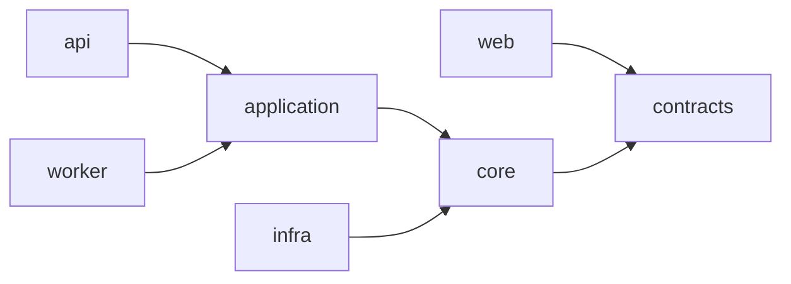

# Engineering Guardrails

How the architecture in [`architecture.md`](./architecture.md) stays true once several people are writing code at speed. Every rule here is either **enforced by a machine** or **listed on a checklist a human signs**. Rules that are neither are aspirations, and this document does not contain any.

Stack is settled: **Next.js web, NestJS on the Fastify adapter, one worker, one Postgres** (ADR 0001, checklist S1).

**Last updated:** 2026-08-21

---

## 1. Repository layout

```
apps/
  web/          Next.js App Router — UI + BFF route handlers that hold the session
  api/          NestJS + Fastify — HTTP interface, webhook ingress, future public API
  worker/       NestJS standalone context — campaign sends, reminders, provider events
packages/
  contracts/    DTOs, error envelope, ULID, cursors: the only package web and api share
  core/         framework-free domain + ports; invariants I1–I12 live here
  application/  use cases; take a Principal; shared by api and worker
  infra/        repositories, migrations, provider adapters, queue, observability
tests/
  invariants/   one test per invariant I1–I12 — the executable form of the architecture
  integration/  real Postgres, real migrations
  e2e/          browser flows through web → api
tools/          repo guardrails, runnable without a package manager
docs/adr/       decision records; numbered, immutable once accepted
```

Every layer directory carries a `README.md` stating what belongs in it, what does not, and what it may import. Those files are generated from `.boundaries.json`, so they cannot drift from what CI enforces.

---

## 2. The dependency rule

One direction only. Inner layers never learn about outer ones.



`api` and `worker` are the composition roots: the only places allowed to wire `infra` into the
graph above.

| Layer | May import | Notably may **not** |
|-------|-----------|---------------------|
| `contracts` | nothing | anything |
| `core` | `contracts` | Nest, Fastify, any ORM, any driver, any provider SDK |
| `application` | `core`, `contracts` | Nest decorators, SQL, transport |
| `infra` | `core`, `contracts` | React, Next |
| `api` | `application`, `core`, `contracts` | `infra` outside a composition root |
| `worker` | `application`, `core`, `contracts` | `infra` outside a composition root |
| `web` | `contracts` | `core`, `application`, `infra`, any driver |

**`web` importing `contracts` only is the load-bearing rule of this table.** It is what keeps domain logic out of the browser bundle and the performance budget reachable. Shared types are a convenience; shared behaviour is a leak.

**Enforced by:** `python tools/check_boundaries.py`, first job in CI, before lint or tests. Run it locally before pushing; it takes under a second and needs no dependencies installed.

```bash
python tools/check_boundaries.py            # check
python tools/check_boundaries.py --matrix   # print the allowed-dependency matrix
```

### Composition roots

Only `apps/*/src/composition/**` and `apps/*/src/main.*` may import `infra`. Everywhere else receives ports by injection. This is what makes the WhatsApp provider decision (checklist E3) reversible: swapping Meta Cloud API for a BSP touches one directory.

---

## 3. Gates

Two kinds. A machine gate blocks the merge; a human gate is a checklist line someone signs.

| # | Gate | Kind | Blocks |
|---|------|------|--------|
| G1 | Layer boundaries clean | machine | merge |
| G2 | An ADR accompanies any change to a rule: `.boundaries.json`, `ci.yml`, or this document | machine | merge |
| G3 | Type check passes with no `any` escape hatches added | machine | merge |
| G4 | Lint passes, no new warnings | machine | merge |
| G5 | Unit tests pass | machine | merge |
| G6 | An invariant test exists and passes for every I1–I12 | machine | merge |
| G7 | Migrations apply to a fresh database, every tenant table has RLS the application role is subject to, and the column conventions hold | machine | merge |
| G8 | Integration tests pass against real Postgres | machine | merge |
| G9 | Performance budget met on the pipeline and contact screens | machine | merge |
| G10 | OpenAPI spec regenerates with no diff, and no endpoint is undocumented. Both halves real since ADR 0045 | machine | merge |
| G11 | Review checklist signed | human | merge |
| G12 | Definition of Done met | human | story closure |
| G13 | Design token contrast meets WCAG in the shipped theme | machine | merge |
| G14 | No secret in the staged diff or in git history | machine | merge |
| G15 | Every Notion page derived from these documents is current, or the drift is acknowledged | machine | merge |

G6 and G7 are the two most easily skipped and the two that matter most. G6 turns the architecture into tests that fail when someone contradicts it. G7 is the difference between multi-tenancy and a data breach with a plausible-looking query.

CI jobs are written so they pass on an empty repository and tighten automatically as the corresponding code lands. A pipeline that is red from day one gets ignored, then disabled.

---

## 4. Invariants as executable specification

`docs/architecture.md` §6 lists invariants I1–I12. Each gets exactly one test file in `tests/invariants`, named for the invariant:

```
tests/invariants/I01-workspace-scoping.spec.ts
tests/invariants/I02-contact-phone-uniqueness.spec.ts
...
tests/invariants/I12-ulid-external-ids.spec.ts
```

Rules:

- **The test asserts the rule, not the implementation.** I6 does not check that a repository method is absent; it attempts an update through every available path and asserts failure.
- **A missing invariant test fails CI (G6),** whether or not the feature it guards has been built. An unbuilt invariant is a `test.todo` with the invariant text as its name, visible, not forgotten.
- **Changing an invariant requires changing the architecture document and an ADR,** in the same commit. The test file cites the invariant ID so the trail is greppable.

This is the single highest-value measure in this document. Prose architecture rots quietly; a failing test does not.

---

## 5. Non-negotiables that are easy to get wrong

Each of these has bitten similar products. They are here because a reviewer needs to check them by name.

**Tenancy.** Every tenant table has `workspace_id NOT NULL` and an RLS policy. Never disable RLS to make a test pass, set the workspace context instead.

**Principal.** Every use case signature starts with a `Principal`. No use case reads an ambient request or a global session. This is what makes the Pro-tier public API additive rather than a rewrite (ADR 0003).

**Money.** Integer pesewas, GHS only. No floats, no decimal strings that get parsed twice. A currency column exists but takes one value for now.

**Time.** Store UTC. Convert at the edge. All "due" and "overdue" arithmetic in `Africa/Accra`. A reminder that fires at the wrong hour destroys trust in the feature that is the product's main promise.

**Phone numbers.** Normalize to E.164 on write, in one function, used by writes *and* by search. A rep typing `024…` must find a contact stored as `+23324…`.

**Append-only history.** `activity` takes inserts only. Corrections are new rows. Withhold `UPDATE`/`DELETE` grants at the database level so the rule survives a well-meaning ORM call.

**Secrets.** Infisical holds every non-public value, and processes get them by injection: `infisical run --env=dev -- pnpm dev` (ADR 0020). `.env.example` names the variables and holds no values. A credential never reaches a file that git can see. Scanning is a gate rather than a habit: staged changes at commit time, full history in CI, both redacted so a finding is not itself printed into a public log.

**Idempotency.** Every job carries a dedupe key. Every webhook handler stores the raw provider event first, keyed on the provider's ID, and stops on duplicate. Provider retries are normal traffic.

**Consent.** Marketing sends check for live consent at send time, in the send path. Not in the UI, which can be bypassed by the API and the worker.

**Conversation window.** Free-form WhatsApp sends are rejected before reaching the provider when the 24-hour window is closed, and the UI shows window state. Do not hide an external rule that changes what the user can do.

**Data fetching in `web`.** Server components and route handlers, not client-side effects. The API is a separate origin now, so a client waterfall costs a round trip per hop on a 3G connection.

**No provider SDK above `infra`.** Not in a controller, not in a use case, not "just for now."

---

## 6. Conventions

**Commits.** Conventional Commits: `type(scope): subject`, subject in the imperative, ≤ 72 characters. Types: `feat`, `fix`, `refactor`, `perf`, `test`, `docs`, `chore`, `build`, `ci`. Scope is a layer or module (`core/crm`, `api/webhooks`, `web/pipeline`).

No agent or tool co-authorship trailers. Commits carry their human author only.

**Branches.** `type/short-description`, e.g. `feat/lead-capture-form`. Work off `main`; no long-lived branches while the team is this size.

**Naming.** Domain vocabulary from `architecture.md` §6 and the ubiquitous language in `mvp-scope.md`. A `Lead` is not an `Opportunity`; a `Deal` is not a `Sale`. If the product doc and the code disagree on a word, one of them is a bug.

**Error handling.** Errors are a first-class part of the product, not a fallback branch (ADR 0018; `docs/error-handling.md` is the working guide).

Every failure is defined once in `packages/contracts/src/errors.ts` with its HTTP status, retryability, whether it is our fault, and **the sentence a person reads**. Domain and use-case failures are typed and carry a code; one exception filter in `api` maps them to the envelope and logs them, layers below throw without logging. Never render `message` to a user; pick copy by code. No silent catch: catch to add context or convert, then rethrow. Nothing internal reaches a client, and every response carries a `requestId`.

**API documentation.** OpenAPI from day one, generated from the code and committed to the repository as `apps/api/openapi.json`. The Zod schema in `contracts` is the single source; the Nest DTO class is a derived adapter in `apps/api` (ADR 0045). See §6.1.

**Files.** One exported concept per file. Directory per bounded context, not per technical kind, `core/src/crm/lead.ts`, not `core/src/entities/`, `core/src/services/`.

### 6.1 OpenAPI, from the first endpoint

Swagger is not a launch task. It ships with endpoint number one (ADR 0015).

- **Generated from the code**, via `@nestjs/swagger` reading DTO classes that `nestjs-zod` derives from the Zod schemas in `contracts` (ADR 0045). There is no hand-written spec, and no shape declared twice.
- **The schema is the source, the class is the adapter.** `<thing>Schema` in `packages/contracts` becomes `<Thing>Dto` in `apps/api`, `class ThingDto extends createZodDto(thingSchema) {}`, with an empty body. A DTO that adds a field means the schema is wrong. `.boundaries.json` forbids `nestjs-zod` and `@nestjs/swagger` in `contracts`, so a DTO class cannot drift into the browser bundle.
- **Two traps a machine will not catch.** `cleanupOpenApiDoc` must wrap the document or the spec generates, looks plausible, and is subtly wrong. And responses take `@ZodResponse`, not `@ApiOkResponse` — the latter documents the *input* shape of a transforming schema. Both are lines on the review checklist.
- **Requests will be validated at the boundary, and are not yet.** ADR 0045 decides a global `ZodValidationPipe` and an `ErrorFilter` branch mapping a Zod failure to `details: FieldError[]`, so that `validation_failed` names the offending fields instead of promising to (ADR 0018). **Neither exists in the repository today**, and until they do, `details` is a field no code path can populate while the error copy tells the user to check the highlighted fields. Nothing validates a request body; the api parses nothing.
- **Committed** as `apps/api/openapi.json`. This is the point: an API change becomes a reviewable diff. A breaking change to a response shape shows up in the pull request instead of in a consumer's logs.
- **Gate G10 has two halves, and both run.** The first regenerates the spec and fails on any diff, so the committed file cannot go stale. The second, `tools/check_openapi_complete.py`, fails an operation with no summary, no `operationId`, no tag, no typed 2xx response, or a request body that is present and untyped. Note the last one precisely: it reads the generated artifact, so a body that failed to generate *at all* is invisible to it — absence and correctness are not the same check. That second half was documented here from 18 August and did not exist until ADR 0045 built it — the sort of claim that is worth checking rather than believing.
- **What G10 still does not check**, stated rather than glossed: that every operation documents a failure response against the error envelope, and that every schema property carries an example. Both are ADR 0015 requirements. The first becomes enforceable once the envelope is a Zod-derived DTO every controller declares; the second would fail today on array properties whose example sits on the item.
- **Every DTO carries an example**, as `.meta({ example })` on the schema in `contracts` rather than an `@ApiProperty` override, so `web` can read the same example for a placeholder. A spec with types but no examples is half a document.
- **Error responses are documented**, not just the happy path. The envelope from §6 is a shared schema referenced by every endpoint.
- **UI exposure:** Swagger UI is always on in local and staging. In production it stays behind authentication until the Pro-tier public API launches, an open `/docs` on a production API is free reconnaissance for an attacker.

Two things this buys beyond documentation. First, the Pro-tier public API (`architecture.md` §8) is then a matter of choosing which of the documented endpoints to expose, not writing a spec from scratch. Second, `apps/web` can generate its typed client from the same spec, which keeps the DTO duplication risk in the web/api split from turning into drift.

---

## 7. Definition of a good pull request

Small, one concern, and reviewable in under twenty minutes. Specifically:

- Touches one layer, or one vertical slice through several, but not two unrelated slices.
- Has tests at the level where the logic lives, domain rules unit-tested in `core`, wiring integration-tested.
- Carries no commented-out code, no `TODO` without an issue reference, no `console.log`.
- States what it does **not** do, when scope was deliberately left out.
- Passes the checklist in [`code-review-checklist.md`](./code-review-checklist.md) before review is requested, not after.

If a PR needs a walkthrough to be understood, it is too big or the code is unclear. Both are fixable before review.

---

## 8. The git workflow

`main` is protected. Nobody pushes to it, including the maintainer, GitHub enforces
this for administrators too.

**The loop**

1. Branch: `type/short-description`.
2. Commit in Conventional Commits form. The `commit-msg` hook checks the shape and
   rejects agent or tool co-authorship trailers; commits carry their human author only.
3. Push. The `pre-push` hook runs the boundary, invariant, contrast, and Notion-mirror
   checks, the four that need no dependencies and finish in about a second.
4. Open a pull request. All four CI jobs must pass, the branch must be up to date with
   `main`, and every review conversation must be resolved.
5. Squash merge. The branch deletes itself.

**Settings, and why**

| Setting | Value | Reason |
|---------|-------|--------|
| Required checks | the four CI jobs, **by exact job name** | Gates G1–G15 are the merge criteria |
| Strict (up to date) | on | A green check against stale `main` proves nothing |
| Administrators | enforced | A rule the owner can skip is a suggestion |
| Required approvals | 0 | A solo maintainer cannot approve their own PR; `main` would deadlock. Raise to 1 the day a second developer joins |
| Code-owner review | off | Same reason. Turn on with the approval count |
| Linear history | on | Squash-only, so history stays readable |
| Force push / deletion | blocked | no |
| Conversation resolution | required | Stops review comments being merged past |

The zero-approval setting is the one compromise here, and it is temporary. Everything
else, checks, up-to-date branches, no direct pushes, no force pushes, applies to
everyone from today.

**A job name in `ci.yml` is the identifier branch protection matches on.** Renaming a job
silently stops the required check from ever reporting, and the pull request becomes
unmergeable with every visible check green, which reads as a GitHub fault rather than as
our own edit. Rename a job and update the required contexts in the same sitting:

```bash
gh api repos/convertap/convert/branches/main/protection/required_status_checks \
  --jq '{strict, contexts}'          # read the current contract before changing a name
```

The trap fires in both directions: passing `-f strict=false` where the API wants a boolean
is rejected outright, but `-F strict=false` is accepted and quietly turns off the
up-to-date requirement documented above. Read the response back rather than trusting the
call.

**Local hooks** are configured in `lefthook.yml` and installed by `pnpm install`. They
are a faster copy of what CI enforces, not a substitute: `--no-verify` exists for
emergencies, and CI still gates the merge.

---

## 9. When a guardrail is wrong

Guardrails encode decisions, and decisions get superseded. The path is: open an ADR that supersedes the old one, change `.boundaries.json` or the gate in the same commit, and say in the PR body which ADR authorises it.

What is not acceptable is editing a rule to make a red build green. G2 exists specifically to catch that: a change to `.boundaries.json`, `.github/workflows/ci.yml`, or this document with no accompanying ADR fails CI.

G2 asks whether a *rule* moved, not whether bytes moved, and it is narrowed twice so that it keeps being believed (ADR 0025):

- In `.boundaries.json` only the layers, import rules and composition roots count. Editing the `ignore` list so build output stops being scanned is a bug fix.
- In `ci.yml` the version an action is pinned to does not count, so `actions/checkout@v4` becoming `@v7` passes on its own CI evidence. Adding or removing a gate step, widening a trigger, cutting a `needs:` edge, rebinding a deploy environment, or swapping the action itself still needs an ADR.

Both carve-outs exist for the same reason: a gate that fires on changes it was never aimed at gets overridden, and an overridden gate protects nothing.
